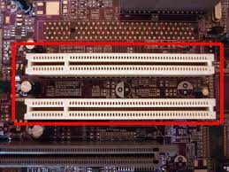

Ao saber que um computador cujo barramento de dados tem 64 bits de largura e o bus opera com uma velociade de relógio de 1.2 Ghz, dessa forma é possível calcular o número de bits por segundo que passam no barramento.

Largura do barramento * velocidade do relógio

64 bits * 1.2 Ghz= número de bits por segundo que passam no barramento

64 * 1.2 Ghz = 76.8 Ghz/s ou 76.8 *10^9 bits/s

